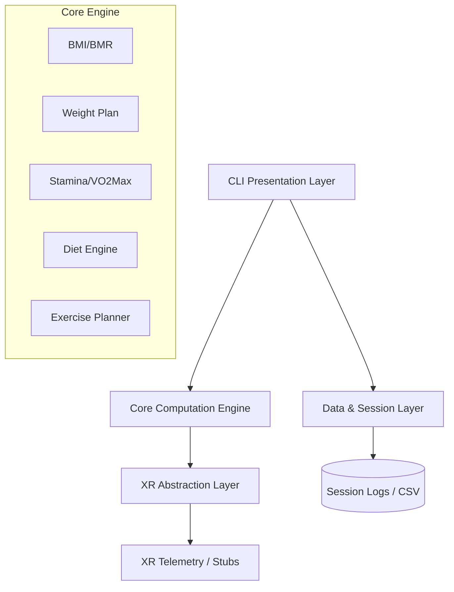

<div align="center">


# ⚡ ATHLETIC ASSISTANT XR

### *Fitness Automation System — Architected for the Future*

[-00599C?style=for-the-badge&logo=c)](https://en.wikipedia.org/wiki/C_(programming_language))
[]()
[]()
[]()

> *"Empowering human performance through modular automation and spatial computing readiness."*

</div>

---

## 🚀 Vision: Fitness Automation System XR

**Athletic Assistant XR** is more than a fitness tracker; it is a modular automation system built in **C**. It features a robust core for health metrics, a dynamic diet planning engine, and a dedicated **XR Abstraction Layer** designed for future integration with spatial computing platforms (OpenXR/WebXR).

---

## 🧩 Architectural Design



---

## ✨ Advanced Features

| Feature | Description |
|---------|------------|
| 🕶️ **XR Abstraction** | Architected with `xr_interface.h` for future AR/VR workout overlays. |
| 📊 **Session Persistence** | Automatic CSV logging of every session for long-term progress tracking. |
| 🧮 **Visual Metrics** | Real-time ASCII gauges for BMI and Stamina zones. |
| 🫀 **VO₂ Max Analysis** | Scientific approximation of aerobic capacity with age-group norms. |
| 🥗 **Nutrition Engine** | 30nd-item food database with precise macro-nutrient splitting. |
| 📅 **7-Day Scheduler** | Complete weekly workout programming with sets, reps, and recovery. |

---

## 👥 Project Team

| Name | Role |
|------|------|
| **Md Hassan** | Lead Developer |
| **Ayyan Eqbal** | Systems Architect |
| **Intekhab Ahmad** | Data Engineer |
| **Adeeeb Asif** | Documentation & QA |

---

## 🛠️ Getting Started

### Prerequisites
- GCC or any C11-compatible compiler
- `make`

### Installation & Build

```bash
# Standard Build
make

# Build with XR Telemetry Enabled
make xr

# Run the CLI system
make run
```

### 🖥️ Web Command Center XR
Launch the premium visual dashboard to track your trends:
```bash
cd dashboard
npm run dev
# Open http://localhost:3000
```

---

## 📚 Documentation

- 📖 [User Manual & Build Guide](docs/USAGE.md)
- 📐 [Scientific Algorithm Reference](docs/ALGORITHMS.md)
- 📦 [Original Project Specification](AthleticAssistantDocfile.pdf)

---

<div align="center">

**Athletic Assistant XR — Professional Series**  
*Precision Engineering for Human Potential*

</div>
